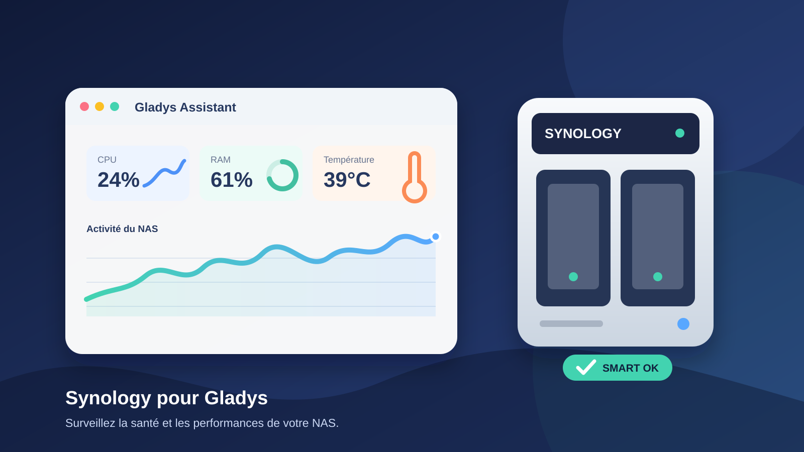

# Intégration Synology pour Gladys Assistant



Cette intégration externe, structurée à partir du
[template JavaScript officiel Gladys](https://github.com/GladysAssistant/integration-template-js),
interroge l'API WebAPI de DSM puis crée et alimente automatiquement des appareils dans Gladys.

## Mesures publiées

- charge CPU et utilisation de la mémoire vive ;
- température du NAS et de chaque disque ;
- état SMART de chaque disque ;
- état, taux d'utilisation et octets disponibles de chaque volume ;
- état et date de dernière exécution des tâches Hyper Backup (optionnel, car l'API varie selon la version du paquet).

Tous les appareils et fonctionnalités utilisent des `external_id` déterministes : un redémarrage
du connecteur ne crée donc pas de doublons.

## Préparation de DSM

1. Créer un utilisateur DSM dédié (par exemple `gladys-monitor`) avec un mot de passe fort.
2. Lui donner uniquement les droits de lecture nécessaires sur **Informations système**,
   **Gestionnaire de stockage** et, si souhaité, **Hyper Backup**.
3. Activer HTTPS dans DSM et employer un certificat reconnu par le conteneur.
4. Ne jamais exposer le port DSM directement sur Internet.

L'accès à SMART et à Hyper Backup dépend de DSM, du modèle et des droits. Une API absente est
ignorée ; une erreur de collecte est journalisée sans arrêter le processus.

## Installation

```bash
cp .env.example .env
# Renseigner .env, notamment le jeton API Gladys
docker compose up -d --build
```

Le jeton Gladys doit appartenir à un utilisateur autorisé à créer des appareils et à publier
leurs états. `POLL_INTERVAL` est exprimé en secondes et ne peut pas être inférieur à 15.

### Certificat DSM auto-signé

La validation TLS est active par défaut. La meilleure solution consiste à ajouter l'autorité de
certification du NAS au magasin de certificats du conteneur (variable Node `NODE_EXTRA_CA_CERTS`).
Pour un essai isolé seulement, `NODE_TLS_REJECT_UNAUTHORIZED=0` désactive globalement cette
protection et n'est **pas** recommandé en production.

## Développement

Node.js 20 ou supérieur suffit ; le projet n'a aucune dépendance d'exécution.

```bash
npm test
npm run lint
```

## Dépannage

- **HTTP 401/403 côté Gladys** : vérifier `GLADYS_TOKEN` et les permissions du compte.
- **Codes DSM 105/106/107/119** : le connecteur renouvelle automatiquement la session.
- **Aucun disque/volume** : vérifier les permissions du compte DSM et la disponibilité de
  `SYNO.Storage.CGI.Storage` sur cette version de DSM.
- **Pas de sauvegarde** : activer `ENABLE_HYPER_BACKUP=true`, installer Hyper Backup et accorder
  au compte l'accès en lecture au paquet.

## Sécurité

Les identifiants ne sont jamais écrits dans les logs ni placés dans l'URL Gladys. Le fichier
`.env` est exclu de Git. Utilisez un réseau Docker privé entre Gladys et cette intégration.
